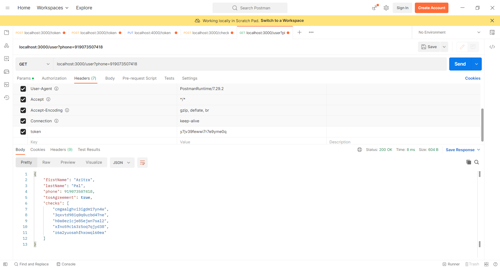
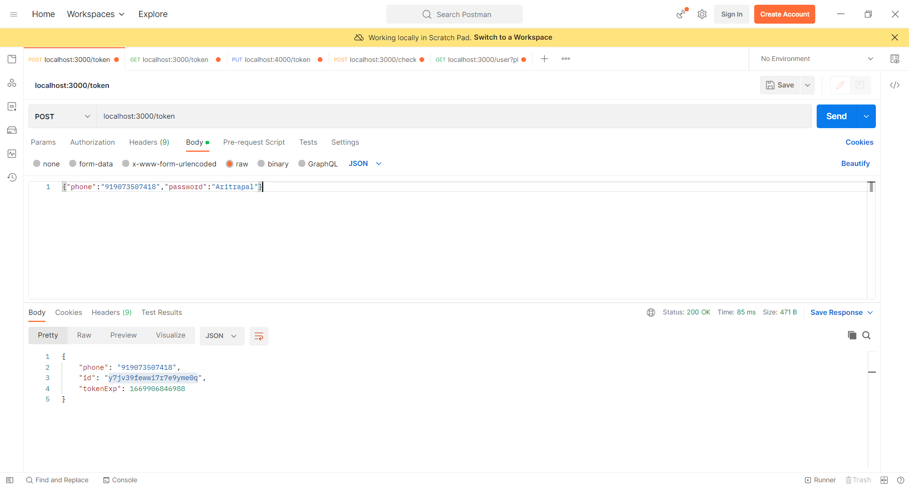
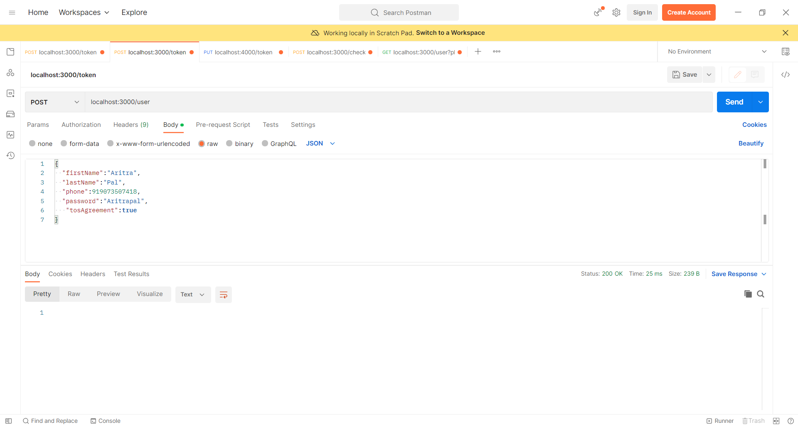
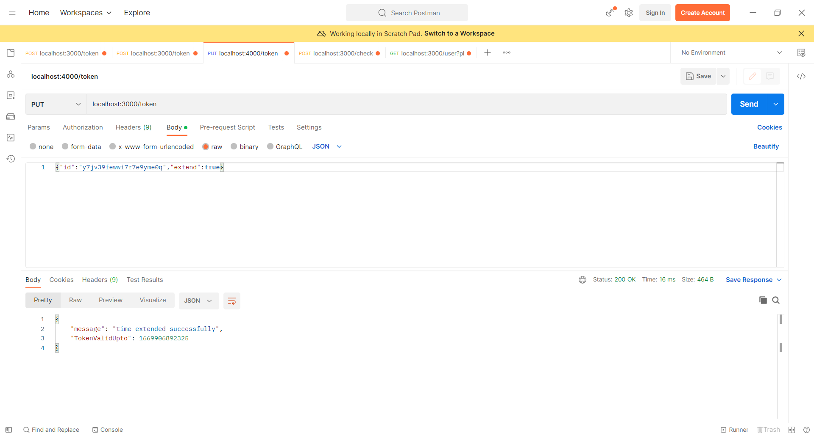
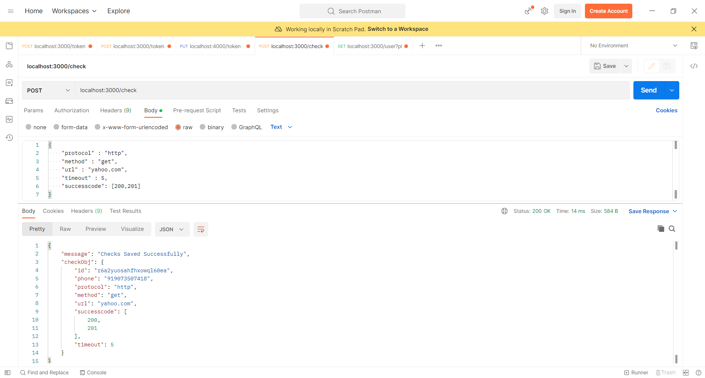

# UpTime_Monitor
### This is a Restful API made on Node that checks a User given Link every single minute and tells if a Llink is up or down ,also Send Sms if the previously the link is up or down.
## Some References

